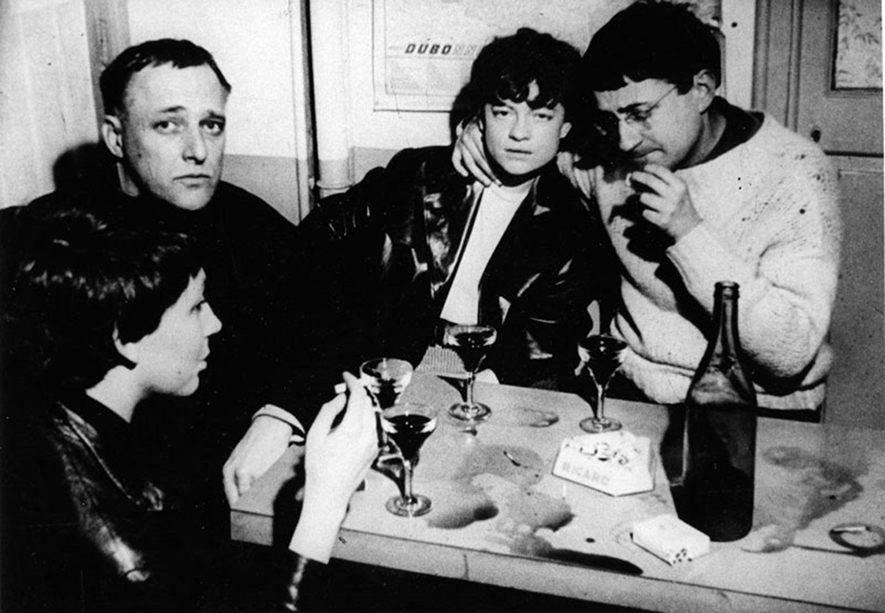

# Authors

 _Guy Debord (right)_

Guy Debord was the most influential figure in the Situationist International,
the subversive group that inspired the May 1968 revolt in France. His book, _The
Society of the Spectacle_, originally published in Paris in 1967, has been
translated into more than twenty other languages and is arguably the most
important radical book of the twentieth century.

 _Ron. Adams (left)_

Ron. Adams is a writer and software engineer living in Somerville Massachusetts,
his writing covers the intersection of media, technology, and power. It is
online at: https://0xadada.pub
